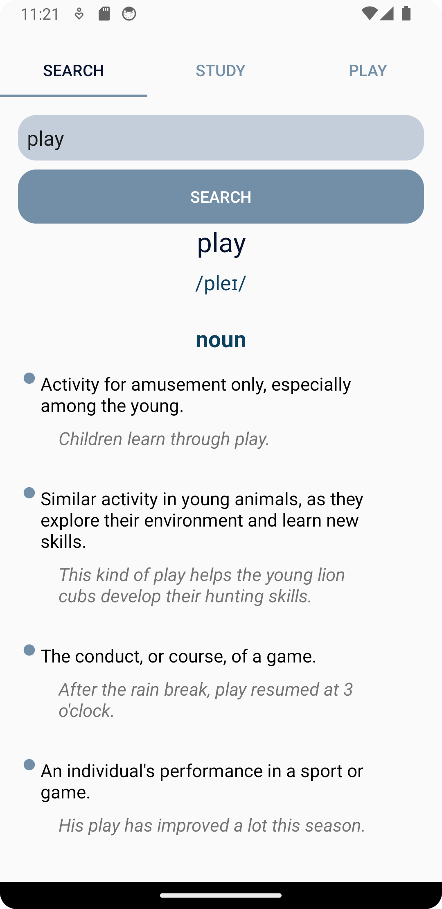
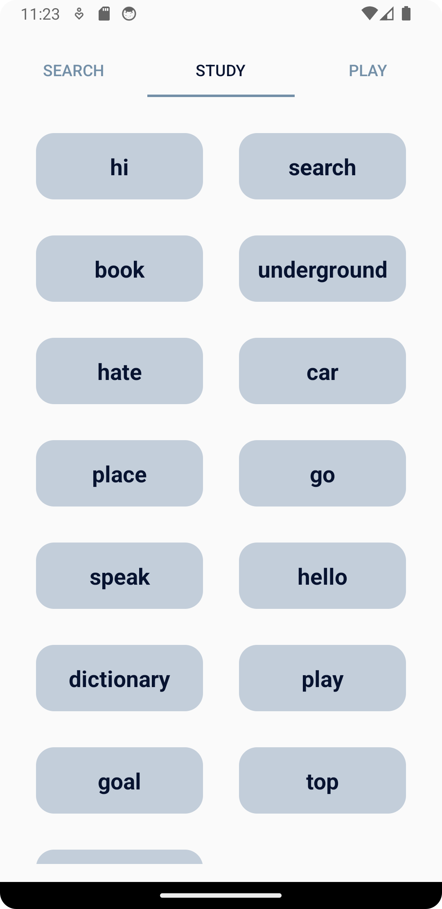
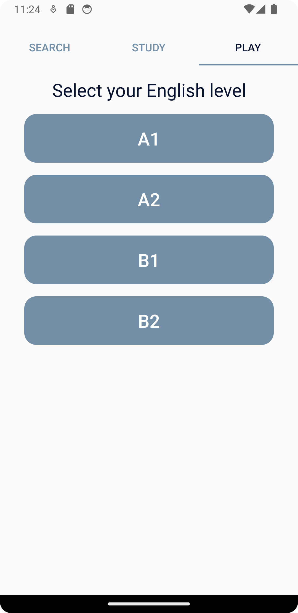
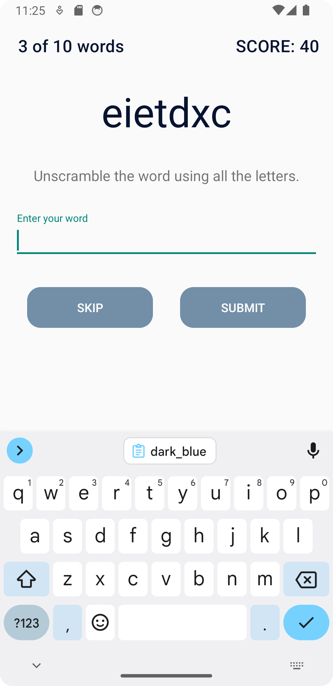

# Dictionary
It is an English to English dictionary. You can search words via dictionaryapi.dev API and study them later. According to your level you can play unscramble game.
Retrofit, MVVM, Repository, Room, Navigation, Hilt

| | | |

